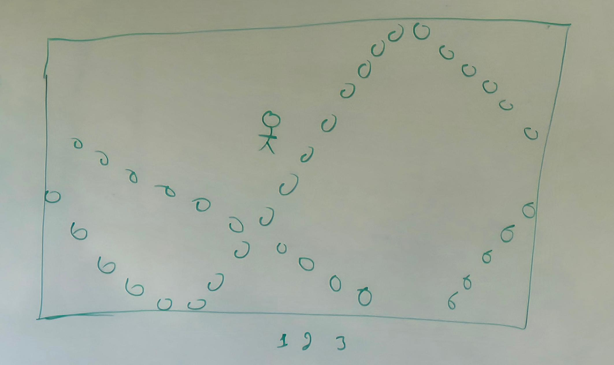

# Planteamiento del Dataset: Juego Esquivar Pelotas



## 1. Descripción del Problema
* **Objetivo:** El muñeco debe evitar chocar con las pelotas que rebotan por la pantalla.
* **Inicio:** El muñeco empieza en el centro del mapa; la pelota (o pelotas) aparece en una posición aleatoria y comienza a rebotar contra las paredes.
* **Meta del modelo:** Decidir en cada momento qué movimiento debe hacer el muñeco (quedarse quieto o moverse) para no ser golpeado.

---

## 2. Acciones Posibles (Salida / Target)
El modelo debe elegir una de las siguientes acciones en cada instante:
* `0`: Quedarse quieto
* `1`: Moverse hacia Arriba
* `2`: Moverse hacia Abajo
* `3`: Moverse a la Izquierda
* `4`: Moverse a la Derecha

---

## 3. Estructura de los Datasets

### Caso 1: Juego con 1 Pelota
Solo necesitamos registrar dónde está el muñeco, dónde está la pelota, hacia dónde se dirige la pelota y qué acción se debe tomar.

| Columna | Significado |
| :--- | :--- |
| `jugador_x` | Posición horizontal del muñeco |
| `jugador_y` | Posición vertical del muñeco |
| `pelota1_x` | Posición horizontal de la pelota |
| `pelota1_y` | Posición vertical de la pelota |
| `pelota1_vx` | Hacia dónde va horizontalmente (-1 o 1) |
| `pelota1_vy` | Hacia dónde va verticalmente (-1 o 1) |
| **`accion`** | Movimiento a realizar (`0` al `4`) |

---

### Caso 2: Juego con 2 Pelotas
Se agrega la información de la segunda pelota para que el muñeco no esquive una y se estrelle con la otra.

* **Datos de entrada:**
  * Muñeco: `jugador_x`, `jugador_y`
  * Pelota 1: `pelota1_x`, `pelota1_y`, `pelota1_vx`, `pelota1_vy`
  * Pelota 2: `pelota2_x`, `pelota2_y`, `pelota2_vx`, `pelota2_vy`
* **Salida:** `accion` (`0` al `4`)

---

### Caso 3: Juego con 3 Pelotas
Sigue la misma lógica, sumando la tercera pelota.

* **Datos de entrada:**
  * Muñeco: `jugador_x`, `jugador_y`
  * Pelota 1: `pelota1_x`, `pelota1_y`, `pelota1_vx`, `pelota1_vy`
  * Pelota 2: `pelota2_x`, `pelota2_y`, `pelota2_vx`, `pelota2_vy`
  * Pelota 3: `pelota3_x`, `pelota3_y`, `pelota3_vx`, `pelota3_vy`
* **Salida:** `accion` (`0` al `4`)

---

## 4. Ejemplo de Filas del Dataset (CSV)
Un registro por cada fotograma o paso del juego:

```csv
jugador_x,jugador_y,pelota1_x,pelota1_y,pelota1_vx,pelota1_vy,accion
250,250,100,120,1,1,2
250,255,105,125,1,1,2