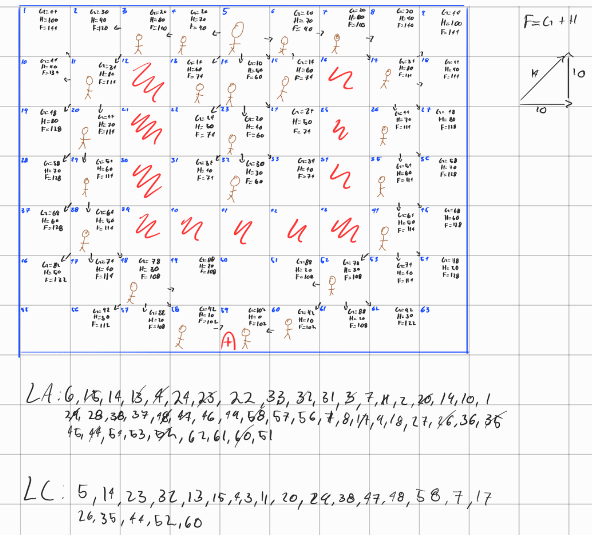

# Resolución de Laberinto con Algoritmo A* (Evaluacion)

Este documento describe el proceso seguido para resolver el laberinto utilizando el algoritmo de búsqueda informada **A***.

---

## 1. Imagen del Laberinto Resuelto

A continuación se muestra el esquema completo con los cálculos de cada casilla ($G$, $H$ y $F$), los punteros de dirección y el registro de la Lista Abierta (LA) y Lista Cerrada (LC):

---

## 2. Reglas y Métricas Utilizadas

El algoritmo selecciona la casilla a explorar minimizando la función de costo:

$$F = G + H$$

* **G (Costo acumulado real):**
  * Movimientos ortogonales (arriba, abajo, izquierda, derecha): **10**
  * Movimientos diagonales: **14**
* **H (Heurística Manhattan hacia la meta 59):**
  $$H = (|\text{fila}_{\text{actual}} - \text{fila}_{\text{meta}}| + |\text{columna}_{\text{actual}} - \text{columna}_{\text{meta}}|) \times 10$$
* **F (Evaluación total):** Suma directa de $G + H$. En caso de empate, se prioriza el nodo con menor valor de $H$.

---

## 3. Configuración del Escenario

* **Origen / Inicio ($\text{O}$):** Casilla **5**.
* **Meta ($\text{A}$):** Casilla **59**.
* **Muros / Obstáculos:**
  * Flanco izquierdo: **12, 21, 30, 39**
  * Base interior: **40, 41, 42**
  * Flanco derecho: **16, 25, 34, 43**
  
---

## 4. Desarrollo de la Búsqueda

1. **Atracción hacia el mínimo local :**
   * El algoritmo partió de la casilla **5** y, guiado por la heurística Manhattan que disminuye hacia abajo, avanzó de forma directa por el centro ingresando a la cavidad a través de las casillas **14 ($F=60$)**, **23 ($F=60$)** y **32 ($F=60$)**.
   * Al llegar a la casilla **32**, todos los movimientos frontales y diagonales hacia abajo quedaron bloqueados por los obstáculos **40, 41 y 42**, dejando al algoritmo sin salida directa en esa dirección.

2. **Evacuación del callejón:**
   * El algoritmo procedió a evaluar las casillas que habían quedado pendientes en la Lista Abierta con $F=74$ (**31, 33, 22, 24, 13 y 15**), agotando las opciones dentro del área cerrada y subiendo nuevamente hacia la apertura superior.

3. **Rodeo por el exterior:**
   * Se expandieron los bordes superiores libres **4** y **6** ($F=80$), actualizando y habilitando las salidas exteriores por **3** y **7** ($F=100$).
   * Siguiendo el flanco exterior izquierdo, el algoritmo descendió de manera fluida sorteando la pared lateral:
     $$3 \xrightarrow{\text{diag}} 11 \rightarrow 20 \rightarrow 29 \rightarrow 38$$

4. **Llegada y convergencia a la meta:**
   * Desde la casilla **38**, se abrió paso en diagonal por debajo de la barrera hacia **48 ($F=108$)** y posteriormente a **58 ($F=102$)**.
   * Finalmente, desde **58** se expandió directamente hacia la meta en la casilla **59**, concluyendo con un costo óptimo evaluado.

---

## 5. Camino Óptimo Final

Rastreando la cadena de padres desde la meta (**59**) hacia el punto de partida (**5**):

$$5 \rightarrow 4 \rightarrow 3 \xrightarrow{\text{diag}} 11 \rightarrow 20 \rightarrow 29 \rightarrow 38 \xrightarrow{\text{diag}} 48 \xrightarrow{\text{diag}} 58 \rightarrow 59$$

* **Costo Real Total ($G$):** **102**
* **Nodos en Lista Cerrada ($\text{LC}$):** Casillas efectivamente evaluadas tras salir del callejón y completar el rodeo hasta la meta.