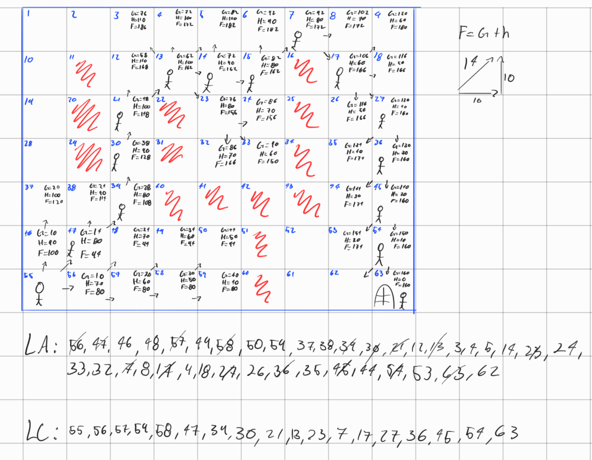

# Resolución de Laberinto con Algoritmo A*

Este documento describe el proceso seguido para resolver el laberinto utilizando el algoritmo de búsqueda informada **A***.

---

## 1. Imagen del Laberinto Resuelto

A continuación se muestra el esquema del laberinto con sus obstáculos, costos y la ruta resultante:

---

## 2. Conceptos Clave y Reglas

El algoritmo A* utiliza una función de evaluación matemática para decidir qué casilla explorar primero:

$$F = G + H$$

* **G (Costo real acumulado):**
  * Movimiento horizontal o vertical: **10**
  * Movimiento diagonal: **14**
* **H (Heurística):** Distancia Manhattan (distancia en línea recta sumando pasos en horizontal y vertical) multiplicada por 10 hacia la casilla meta.
* **F (Costo total estimado):** Suma de $G + H$. La casilla con menor $F$ en cada paso es la que tiene mayor prioridad para expandirse.
* **Listas de control:**
  * **LA (Lista Abierta):** Nodos descubiertos que están pendientes de evaluación.
  * **LC (Lista Cerrada):** Nodos que ya fueron explorados y procesados.

---

## 3. Configuración Inicial del Laberinto

* **Punto de Inicio:** Casilla **55** (esquina inferior izquierda).
* **Punto Meta (Objetivo):** Casilla **63** (esquina inferior derecha).
* **Obstáculos (muros intransitables):** 11, 16, 20, 22, 25, 29, 31, 34, 40, 41, 42, 43, 51 y 60.

---

## 4. Resumen del Procedimiento Realizado

1. **Intento por la ruta inferior directa:**
   * El algoritmo partió de la casilla **55** e intentó avanzar hacia la derecha por la fila inferior pasando por las casillas **56, 57, 58 y 59**.
   * Al llegar a la casilla **59**, se encontró con una pared.

2. **Exploración de alternativas y rodeo:**
   * Al toparse con el bloqueo, el algoritmo consultó la Lista Abierta (**LA**) buscando las casillas con menor valor de **F** que quedaban pendientes.
   * Retrocedió explorando hacia arriba por el costado izquierdo cruzando por las casillas **47, 39, 30 y 21**.

3. **Cruce por la zona superior:**
   * Desde la casilla **21**, avanzó hacia el centro y parte superior utilizando las casillas libres **13, 14, 15** y cruzó en diagonal hacia la **7**.

4. **Descenso final hacia la meta:**
   * Al rodear por completo los obstáculos centrales y la pared divisoria, comenzó a descender por el costado derecho a través de las casillas **17, 27, 36, 45 y 54**.
   * Finalmente, desde la casilla **54** alcanzó la meta en la casilla **63**.

---

## 5. Camino Óptimo Resultante

Siguiendo los punteros de cada casilla hacia atrás (desde la meta hacia el origen), la ruta óptima encontrada es:

$$55 \rightarrow 47 \rightarrow 39 \rightarrow 30 \rightarrow 21 \rightarrow 13 \rightarrow 14 \rightarrow 15 \rightarrow 7 \rightarrow 17 \rightarrow 27 \rightarrow 36 \rightarrow 45 \rightarrow 54 \rightarrow 63$$

* **Costo Total del Camino ($G$):** **164**